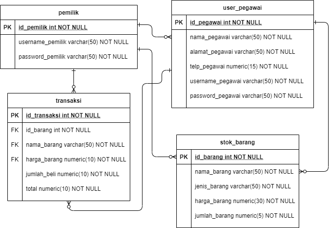
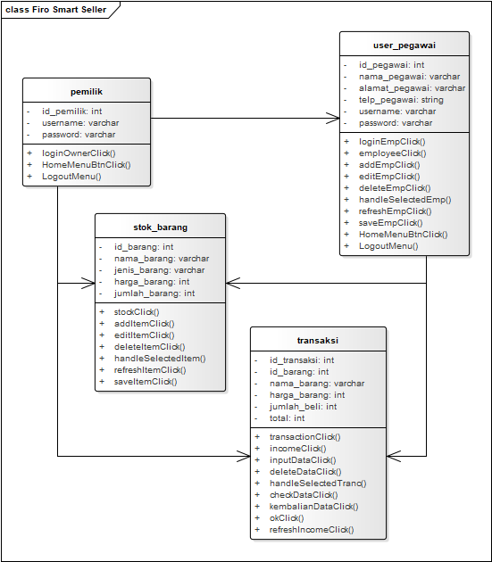

# FSE ( FIRO SMART SELLER )
Projek UAS PBO 2

Kelompok : 10

Anggota Kelompok (Beserta NiM) :
1. Figo Perdana Putra (192410102022) = https://github.com/figoperdana
2. Fitri Dwi Alfina (192410102085) = https://github.com/ffitridwia

Link : https://github.com/figoperdana/pbo2-kelompok10/

  Proses penjualan dan ketersediaan barang merupakan proses yang sangat penting bagi perusahaan dalam meningkatkan pendapatan perusahaan. Penerapan komputer dan sebuah sistem informasi penjualan dan ketersediaan barang menjadi suatu solusi karena dapat mendukung kinerja dalam bagian-bagian yang berhubungan dengan penjualan serta mendukung pengambilan keputusan untuk mencapai tujuan perusahaan. Di Toko Firo masih kurang dalam pendataan transaksi dan pendataan ketersediaan barang petugas harus mendata transaksi secara manual hal ini membuat banyak kesalahan saat mendata transaksi dari ketersediaan barang. Cara manual ini pastinya akan memakan waktu yang cukup lama dan tidak efisien dalam pelayanan pada pelanggan atau pengecekan barang, banyak menimbulkan kesalahan pada saat pendataan transaksi atau penyetokan barang. Cara manual ini pastinya akan memakan waktu yang cukup lama dalam pelayanan pada pelanggan atau pengecekan barang serta banyak menimbulkan kesalahan pada saat pendataan transaksi atau penyetokan barang. 
  
  Sistem informasi penjualan dan ketersediaan barang berbasis computer dalam penyajian yang diperlukan dapat langsung disajikan baik pada layout layar monitor. Berdasarkan masalah yang sudah diuraikan tersebut, maka dibutuhkan suatu sarana yang dapat membantu dalam pengelolaan transaksi lebih cepat, efisien dan tidak terjadi kesalahan transaksi. Salah satu alternatif yang dapat membantu menyelesaikan yaitu penulis mengangkat judul Tugas Projek Akhir “Sistem Informasi Penjualan Dan Ketersediaan Barang di Toko Firo”.

Fitur : 

- Login yaitu pada laman ini user (admin) diminta untuk melakukan login. User
  yang sudah terdaftar pada aplikasi FSE (Firo Smart Seller) maka dipersilahkan 
  untuk login dengan username dan password yang dimiliki.

- Halaman Menu yaitu pada laman ini terdapat beberapa fitur yang ada pada 
  aplikasi FSE (Firo Smart Seller) yaitu stok, transaksi, user pegawai, dan 
  logout.

- Halaman Stok Barang yaitu pada laman ini terdapat tabel berisi kode barang, 
  jenis barang, jumlah stok barang, dan harga barang. Di laman ini juga terdapat 
  fitur tambah, ubah, dan hapus data barang.

- Halaman transaksi atau kasir yaitu pada laman ini dilakukan kalkulasi harga 
  barang yang telah diorder pembeli dengan cara admin melakukan input 
  barang.

- Halaman User Pegawai yaitu pada laman ini admin dapat menambah user 
  pegawai pada database pegawai dengan rincian nama pegawai, alamat 
  pegawai, nomor telepon pegawai, username akun pegawai, dan password akun 
  pegawai.
  
- Logout yaitu user keluar dari program FSE (Firo Smart Seller)

# ERD FSE ( FIRO SMART SELLER ) 

# CLASS DIAGRAM FSE ( FIRO SMART SELLER ) 

